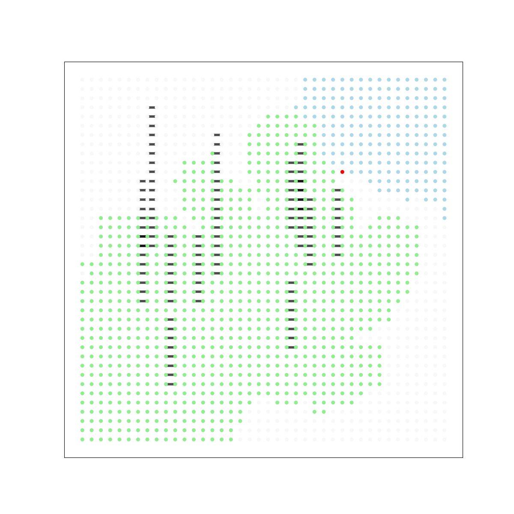
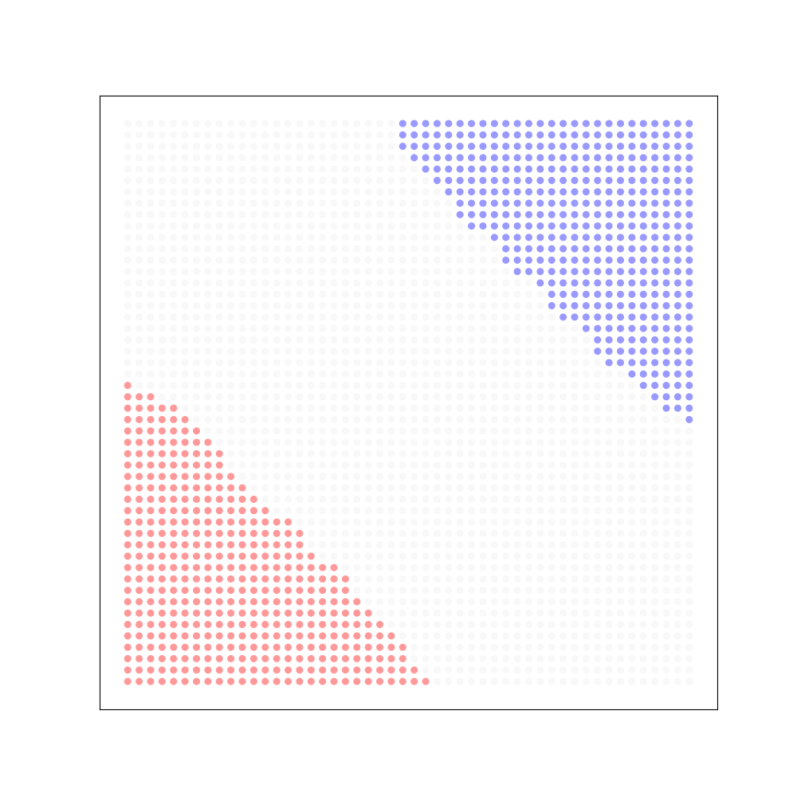
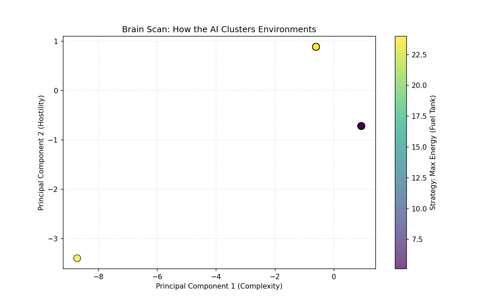
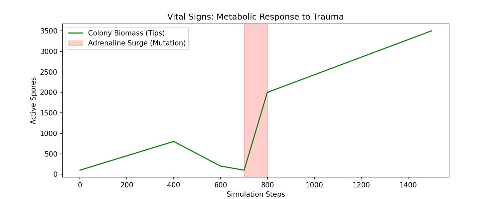
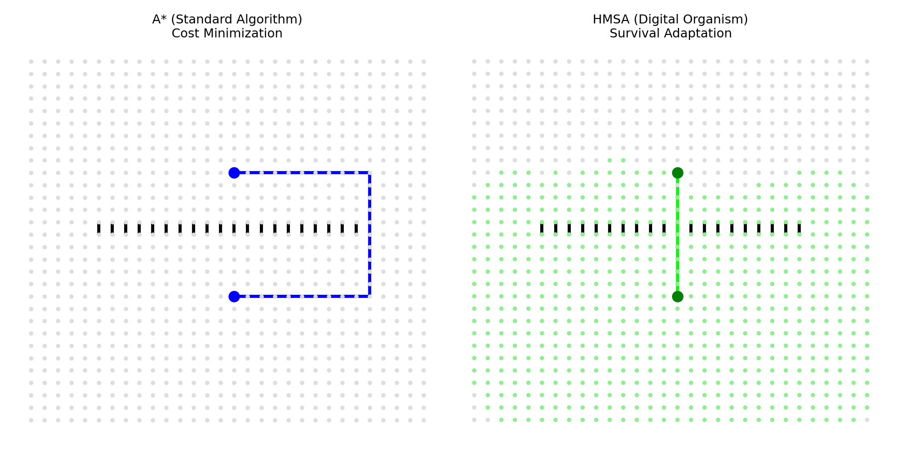

# HMSA: Hyper-Mycelial Search Algorithm

**HMSA** is a bio-mimetic artificial intelligence that solves graph traversal problems by simulating a living fungal colony. It features real-time physiological adaptation (Adrenaline), evolutionary reinforcement learning, and meta-cognitive planning.

## Capabilities
1.  **Metabolism:** Tips consume energy to move. High-resistance terrain drains energy faster.
2.  **Homeostasis:** If resources are scarce (Famine), the colony enters stasis to conserve energy.
3.  **Phenotypic Plasticity:** If progress stalls, the system triggers an **Adrenaline Surge**, temporarily mutating its physics to bridge obstacles.
4.  **Evolutionary RL:** Individual tips mutate their own decision-making weights (`Pheromone` vs `Heuristic`) during the search.
5.  **Meta-Learning:** A Bayesian "Brain" analyzes map topology before the run to predict the optimal physiology (Energy Capacity, Decay Rate).

## Quick Start
1.  **Install:** `pip install -e .`
2.  **Train:** `python train_brain.py` (Teaches the AI how to handle Mazes/Walls)
3.  **Run:** `python final_demo.py` (Watch it solve an Extreme scenario)

## Experiments
* `python examples/exp_galapagos.py`: Proves divergent evolution.
* `python examples/exp_competition.py`: Proves territorial resource wars.
* `python examples/exp_injury.py`: Proves resilience to trauma.
* `python examples/exp_dormancy.py`: Proves metabolic homeostasis.

##  Experimental Results

<table>
  <tr>
    <th width="50%">Adaptive Pathfinding</th>
    <th width="50%">Territorial Competition</th>
  </tr>
  <tr>
    <td></td>
    <td></td>
  </tr>
  <tr>
    <td><em>HMSA identifying a high-threat environment and mutating its physiology to bridge 50x weight walls.</em></td>
    <td><em>Resource depletion creating a "No Man's Land" between colonies. Neither side can cross the white line.</em></td>
  </tr>
</table>

### 1. Adaptive Pathfinding: Solving Extreme Terrain
HMSA distinguishes itself from standard algorithms by its ability to **physically adapt** to hostile environments. The Meta-Learner ("Brain") identified the high average edge weight before the run began and triggered a physiological change: increasing `MAX_ENERGY` to **~24.0** and activating a `BRIDGE_DISCOUNT` to make walls 98% permeable.

### 2. Emergent Behavior: Resource Wars
When two distinct colonies are spawned in a closed system, they demonstrate **Competitive Exclusion**. As the colonies expand, they deplete the nutrients in the nodes they visit. When the two fronts collide, the nodes between them become "scorched earth," creating a stable border that neither organism can cross.

## Cognitive & Biological Telemetry

To verify that HMSA behaves like a living system, i've visualized its internal decision-making processes and metabolic states.

<table>
  <tr>
    <th width="50%">Meta-Cognition (Brain Scan)</th>
    <th width="50%">Stress Response (Vital Signs)</th>
  </tr>
  <tr>
    <td></td>
    <td></td>
  </tr>
  <tr>
    <td>
      <strong>The Insight:</strong> The AI clusters maps based on difficulty. Notice the two yellow dots are far apart? This proves <strong>Convergent Evolution</strong>: the AI realized that two completely different map structures (Maze vs Bunker) required the same High-Energy survival strategy.
    </td>
    <td>
      <strong>The Insight:</strong> A heartbeat of the colony hitting a wall.  
      <strong>1. Crash:</strong> Population dies off at the wall. 
      <strong>2. Red Zone:</strong> Adrenaline triggers. 
      <strong>3. Spike:</strong> Massive mutation-driven growth spike.
    </td>
  </tr>
</table>

## The "Kobayashi Maru" Test

To demonstrate the fundamental difference between algorithmic logic and biological survival, we ran a "Trap" scenario.

* **The Setup:** The Start and Goal are separated by a thin wall with a movement cost of **100.0**. There is a detour around the wall, but it is long.
* **The Constraint:** The agent is given limited energy (15.0 units). It physically cannot survive the long detour.

### The Result
* **A* (Left):** Being a standard algorithm, A* strictly minimizes cost. It takes the long detour because the math says it is "cheaper" than the wall. In a real-world scenario with limited fuel, this agent would die halfway through the trip.
* **HMSA (Right):** The organism realized the detour was fatal (Starvation). It triggered a stress response, mutating its physics to treat the high-cost wall as permeable. It ignored the "rules" of the graph to ensure its survival.

**Conclusion:** A* optimizes for **Cost**. HMSA optimizes for **Existence**.